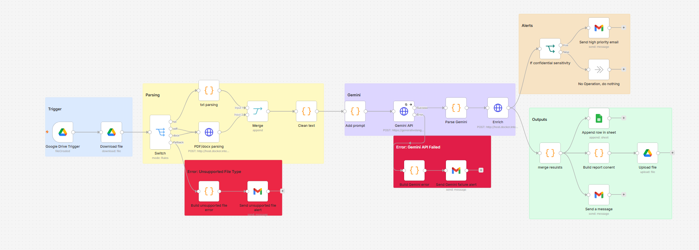
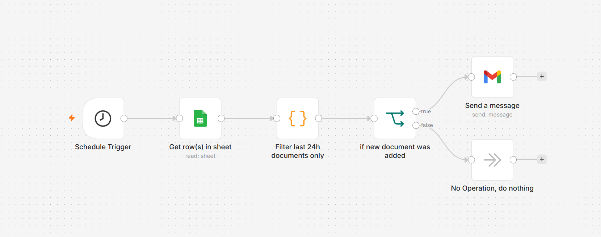
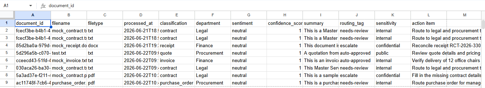
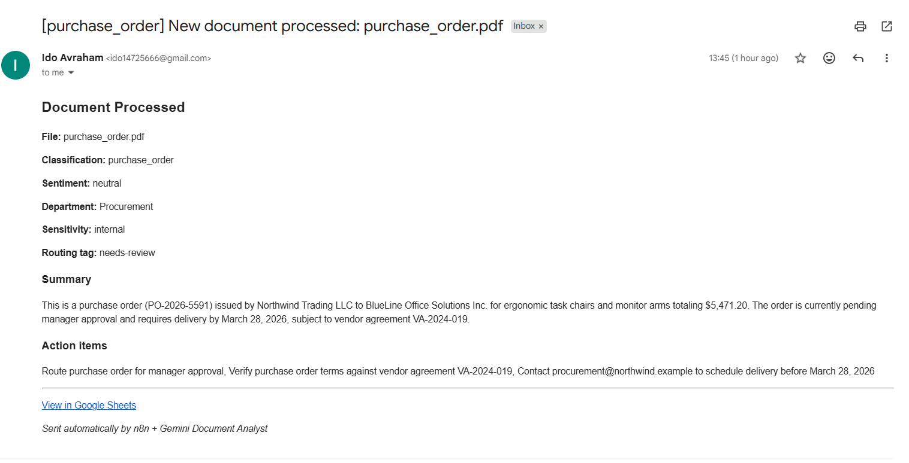
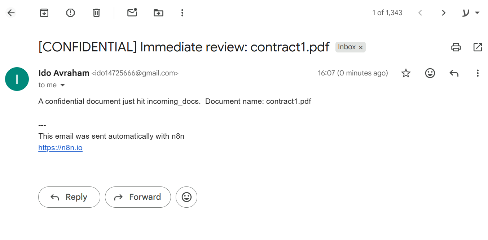
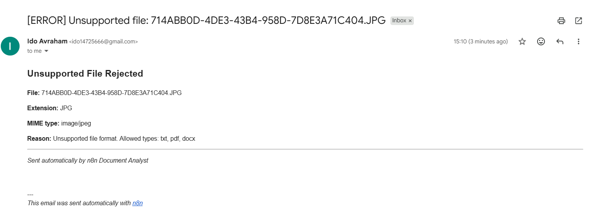
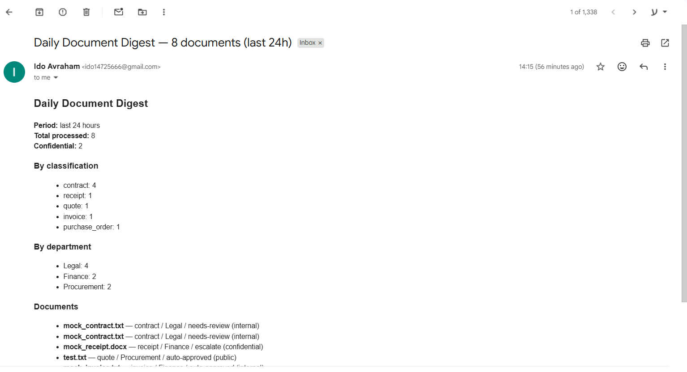

# Intelligent Cloud Document Analyst

**Scenario:** Business documents · **Stack:** n8n · Gemini 3 Flash · Flask · Google Sheets · Gmail

---

## Overview

This project implements **2 n8n workflows** (JSON exports in `workflows/`):

**1. Document Analyst (main)**  
`incoming_docs` upload → parse (`extract_api` / Code) → Gemini analysis → enrich (`metadata_api`) → Google Sheets + `output_docs/` (`.json` + `.md`) + email · fallback: bad file type / Gemini error / confidential alert

**2. Daily digest (bonus)**  
Every day at **4:15 PM** → read Google Sheets → filter last 24h → build summary → Gmail digest

Both Flask APIs must be running: `extract_api` (**8001**) · `metadata_api` (**8000**)

---

## Project structure

| Path | Role |
|------|------|
| `extract_api/` | PDF & DOCX text extraction (Flask, port 8001) |
| `metadata_api/` | Metadata enrichment (Flask, port 8000) |
| `workflows/` | `Document Analyst.json` · `send_daily_mail.json` |
| `images/` | Screenshots below |

---

## The two workflows

**1. Document Analyst (main)**

[Open full size](./images/main_flow.png)

**2. Daily digest (bonus)**

[Open full size](./images/daily_mail_flow.png)

---

## Workflow 1 — Document Analyst (breakdown)

| Stage | What happens |
|-------|----------------|
| **Trigger** | New file uploaded to `incoming_docs` (Google Drive) → download |
| **Parsing** | Switch: **txt** (Code) · **pdf/docx** (`extract_api`) → Merge → Clean text |
| **Gemini** | Prompt → Gemini 3 Flash (JSON) → Parse |
| **Enrich** | `metadata_api` — department, sensitivity, routing tag |
| **Outputs** | Google Sheets row · `output_docs/{filename}_report.json` · `output_docs/{filename}_report.md` · completion email |

**Fallback logic**

| Branch | When | Result |
|--------|------|--------|
| Unsupported file | Switch fallback | Rejection email |
| Gemini failure | HTTP error output | Alert email |
| Confidential doc | After Enrich | Immediate review email |

**Proof of working outputs**

**Google Sheets — logged results**

**New document processed — completion email**

**Confidential document — immediate review alert**

**Unsupported file type — rejection alert**

---

## Workflow 2 — Daily digest (breakdown)

| Step | What happens |
|------|----------------|
| Schedule Trigger | Runs once per day |
| Get row(s) in sheet | Reads results spreadsheet |
| Code | Filters last 24h · builds HTML summary |
| IF | Sends only when documents exist |
| Gmail | Daily digest email |

**Daily digest — summary of last 24h**

---

## Python APIs

### extract_api (port 8001)

Handles text extraction for **PDF** (PyMuPDF) and **DOCX** (python-docx). Called from the main workflow on the pdf/docx branch — n8n sends the downloaded file to `POST /extract` (multipart field `file`). Returns `filename`, `file_type`, `extracted_text`.

| Endpoint | Description |
|----------|-------------|
| `GET /health` | Health check |
| `POST /extract` | Extract text from uploaded PDF or DOCX |

### metadata_api (port 8000)

Called after Gemini parsing. Adds business-specific metadata on top of the AI output.

| Endpoint | Description |
|----------|-------------|
| `GET /health` | Health check |
| `GET /categories` | Business document categories |
| `POST /sensitivity` | Returns `public` / `internal` / `confidential` |
| `POST /enrich` | Adds `document_id`, `department`, `sensitivity`, `routing_tag`, `keyword_tags`, adjusted `confidence_score`, `processed_at` |

Both services must be started before running the Document Analyst workflow.

### Drive & Sheet links  

**incoming docs:** https://drive.google.com/drive/folders/1f6S2vmI0DtyMAnvaNfMgBASTldg4Srod  
**output_docs:** https://drive.google.com/drive/folders/1HwPH5E-1aIpV4GO0ATwLpSwCDPKQLZzH  
**Sheet:** https://docs.google.com/spreadsheets/d/1-n8CBdpSwzuI5MeJIsaMLSgb9vmNyIwlwTCoaZ5bjuY/edit?usp=drivesdk

